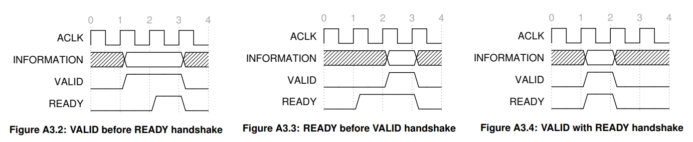
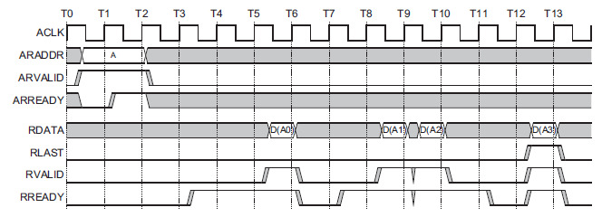
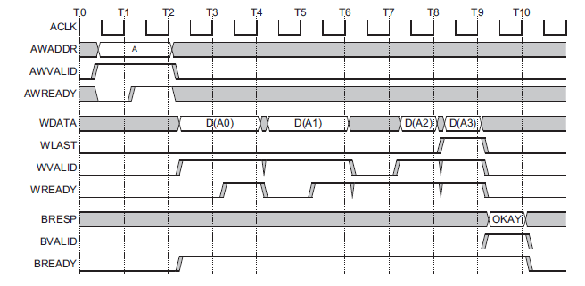

# AXI 

## 1. 개요

**"Advanced eXtensible Interface"**  
- Specification : https://developer.arm.com/documentation/ihi0022/latest/

ARM에서 정의한 On-chip bus protocol들을 AMBA(Advanced Microcontroller Bus Architecture)라고 한다.
 AMBA에는 APB, AHB, AXI 등이 있는데 뒤로 갈수록 더 빨라진다. AMBA 프로토콜 중 가장 속도가 빠른 것이 AXI이다.
 이는 Burst read/write 지원, ID 도입을 통한 out-of-order 실행 지원, channel과 register slice 도입을 통한 freq. 고속화 등에 기인한다. 
 (참고 : https://www.linkedin.com/pulse/difference-between-axi-ahb-complete-guide-sougata-bhattacharjee)
 
 AXI는 _기본적으로_ 5개의 독립적인 channel로 구성되고, 각 채널은 다시 여러 개의(꽤 많은..) signal로 구성된다.
 이 5개의 채널은 **write request(AW), write data(W), write response(B), read request(AR), read data(R)** 이다.
 여기에 더해 ACLK, ARESET 등 어떤 채널에도 속하지 않은 Interface level signal 몇 개가 더 있다.
 
 (Snoop channel도 존재하지만, AXI에서 필수 요소는 아니다.
 이건 DVM(Distributed Virtual Memory) message 송수신에 쓰이는데, 이는 주로 cache coherence를 위해 사용되는 기능이다.)
  

## 2. 단계별 작동 원리

### 2-1. Handshake
Handshake는 별도의 채널이나 signal이 아니라, 모든 채널에서 데이터 전송을 시작하기 전에 반드시 거쳐야 하는 단계이다.
 모든 전송은 Handshake를 한 후에 시작된다. Handshake란 source와 destination이 각각 데이터를 보낼 준비, 받을 준비가 되었다고 
 서로 확인해주는 단계이다. 이 때 source와 destination은 (master, slave) 쌍일 수도 있고 (slave, master) 쌍일 수도 있다.
 Handshake는 READY, VALID 두 개의 signal을 통해 이루어진다.
 Source는 데이터가 준비되어 해당 signal로 입력할 때 VALID도 HIGH로 바꿔준다. Dest.는 받을 수 있으면 READY를 HIGH로 바꿔준다.
 VALID와 READY가 모두 HIGH일 때만 데이터가 수신된다.
 
 이 때 READY와 VALID 중 무엇이 앞서야 하는지는 경우에 따라 다르다. 일부 예시가 Figure A3.5, A3.6에 규정되어 있다.
 아래 그림에서 A->>B는 A가 반드시 B보다 앞서야 한다는 뜻이고(must), A->B는 앞서도 된다는 뜻이다(can).
 가령 Figure A3.6에서 RVALID(slave)는 반드시 ARVALID(master)와 ARREADY(slave)가 HIGH가 되기를 기다려야 하는데,
 이는 read request가 끝나야 데이터를 꺼내올 주소를 알게 되고, 그래야만 데이터를 준비하고 RVALID를 HIGH로 바꿀 수 있기 때문이다.
 

### 2-2. Read/Write Request
Request 채널의 핵심은 크게 다음 네 가지이다. **AxLEN, AxSIZE, AxADDR, AxBURST**. (x에는 R 또는 W가 들어간다.)
 LEN은 한 사이클에 전송하는 데이터의 최대 크기[Byte], SIZE는 그걸 몇 번 보낼건지, ADDR는 첫 전송에 사용할 주소, 
 BURST는 그 다음 전송부터 주소를 어떻게 바꿀 건지에 대한 정책이다.
 다른건 다 직관적인데 burst가 조금 헷갈릴 수 있다. burst는 말 그대로 한번에 데이터를 연속해서 쓰거나 읽어오겠다는 뜻이다.
 
 burst 옵션으로는 fixed, incr, wrap이 있다.
 fixed는 그냥 같은 주소를 계속 쓴다는 뜻으로, FIFO 메모리 등에 데이터를 넣거나 가져올 때 쓰인다.
 incr은 매 전송마다 주소를 계속 증가시킨다는 뜻으로, 얼마나 증가할지는 LEN에 따라 결정된다. 이 옵션이 디폴트다.
 wrap은 "wrap boundary" = (INT(Start_Address/(SIZE\*LEN))) \* (SIZE*LEN) 를 설정하고, 
 N번째 start addr.가 wrap boundary + (SIZE\*LEN)이 되면 start addr.를 wrap boundary로 내려주는 방식이다.
 즉 주소의 하한선과 상한선을 정해두고 그 안에서 incr 모드처럼 작동하다가 상한선에 도달하면 하한선으로 이동하는 방식이다. 
 (참고 : https://stepintoverification.blogspot.com/2019/04/wrapping-burst-in-axi.html)
 
 이 모든 것을 slave가 잘 받고 AxREADY 신호를 보내면 다음 단계인 Read/Write로 넘어가게 된다.

### 2-3. Read/Write
READ/WRITE 채널의 핵심은 크게 다음 세 가지이다. **xDATA, xSTRB, xLAST**. (x에는 R 또는 W가 들어간다.)
 DATA는 말그대로 송신/수신할 데이터를 위한 signal이다. 
 STRB는 strobe의 약어로, 바이트 단위로 write/read 동작을 끌 수 있는 기능이다.
 디폴트로는 당연히 모든 바이트 값을 그대로 읽거나 쓸 수 있도록 허용하고 있다.
 만약 특정 바이트만 읽기, 쓰기 동작시 제외하고 싶다면 STRB에서 해당 순서의 비트를 LOW로 바꿔주면 된다.
 마지막으로 xLAST는 데이터 전송이 끝났음을 알리는 신호이다. WLAST는 master가, RLAST는 slave가 보낸다.
 
 이 때 왜 xLAST를 쓰는 걸까? 이미 request 단계에서 LEN, SIZE를 알려줬으니 그 만큼 받고 끝내면 되는 것 아닌가?
 그럼 계속 얼마나 받았는지 카운트해서 그 값을 저장하는 회로가 있어야 하니, 그러기보다는 그냥 LAST 기다리다가 받는게
 더 간단하기 때문이 아닐까 싶다. 뭐든 간단하게 만들수록 구현도 쉽고 고장도 안 나니까..?
 LAST를 마지막으로 데이터 전송이 끝나면 마지막 단계인 response로 넘어간다.

### 2-4. Response
일단 read의 경우 별도의 read response 채널이 없다. response에 필요한 signal들은 모두 read 채널 안에 포함되어 있다.
 write에서만 response signal들을 별도의 채널로 분리한 이유는 register slice를 사용하기 위해서이다.
 고속 bus에서는 도선의 길이가 길어질수록 각 도선의 도착 타이밍을 맞추기 힘들다. (즉 싱크 맞추는게 어렵다.) 
 그렇기 때문에 master로부터 상대적으로 먼 slave에 접근할 때는 중간에 register slice를 넣어서 1 클럭 사이클을 더 쓰고 싱크를 맞춰주는
 방법을 쓸 수 있는데, 이는 채널을 구성하는 도선들의 방향이 모두 같을 때 훨씬 물리적으로 구현하기 쉽다.
 따라서 같은 채널 안의 signal들은 보통 handshake에 쓰이는 READY를 빼놓고는 모두 같은 방향을 가지는데, 이 때문에
 이 때문에 read와 방향이 같은 read response signal들은 read 안에 포함시키고, write와 방향이 다른 write response signal들은
 별도의 채널로 분리한 것으로 추정된다. (참고 : https://blog.naver.com/esoclab/20174607608)
 
 response의 핵심은 write의 경우 BRESP, read의 경우 RRESP signal인데, 사실 둘 다 필수는 아니다.
 xRESP_WIDTH=0으로 설정하면 둘 다 디폴트로 유지되며, 디폴트는 000(OKAY)이다. 
 (그렇지만 response는 전송 오류 감지를 위해 있는게 좋지 않을까..? 왜 optional인 걸까?)
 xRESP는 디폴트값 외에 6개의 옵션을 추가로 가지며, 이 중 하나만 EXOKAY(Exclusive Read/Write Succeded)로 성공을 의미하고
 나머지 5개는 다 어떤 이유로 실패했는지를 의미한다.
 (Exclusive Access 관련 참고 : https://electronic-hwan.tistory.com/entry/AMBA-Bus-AMBA-AXI-Write-Response-Channel)
  

## 3. 예시 Timing Diagram 살펴보기 

 
